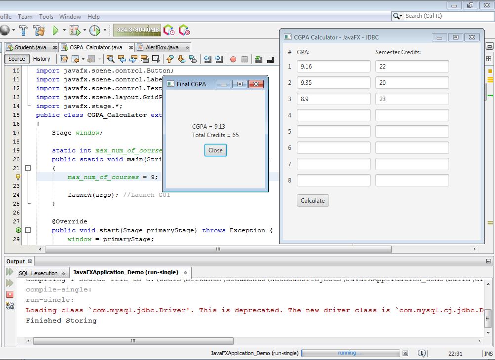
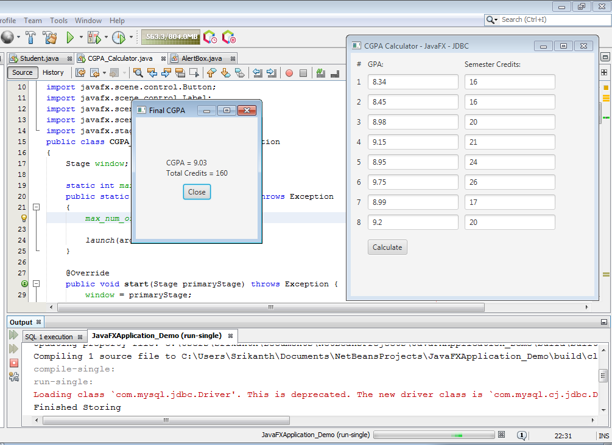

# CGPA-Calculator
This is a very basic JavaFX based application that is used to calculate CGPA, 
 given GPA and credit values for each semester. 
Each GPA and credit value is stored in a local MySQL Database. 
The data is then retrieved and the total CGPA is calculated and displayed. 
This is a basic project to demonstrate the basics and fundamentals of frontend and backend development as a whole.

# Output:

# Requirements:
- JDK 8 or above (until the version when JavaFX was discontinued) 
- MySQL Server 5.7.9 or above 
- Netbeans IDE (Or any other IDE to edit the source code) 

# Instructions
- Use AlertBox.java as is 
- Modify Database URL's in CGPA_Calculator.java to reflect your own database 
- Modify username and password accordingly 
- Create a table 'grades' with columns : grade and credits (Or any desired column names)
